# Diagramas y Documentación del proyecto ODP

La clase OptimizationService es el centro del sistema.

Depende de dos componentes principales:

- OptmizationRepository, que ejecuta las consultas de negocio y el modelo.

- SessionRepository, que maneja los datos en sesión (caché, estado intermedio).

```mermaid
classDiagram
    class OptimizationService {
        -repository: OptmizationRepository
        -session_repository: SessionRepository
        +apply_changes(Request, OptimizationEntitiesRequestModel, float): Tuple
        +run_model(OptimizationRequestModel): OptimizationResponseModel | OptmizationErrorModel
        +get_maestro_especificacion_producto_politica(Request, MaestroEspecificacionProductoPoliticaRequest): List
        +get_ds_producto_politica_cuota(Request, OptimizationEntitiesRequestModel, List): DSProductoPoliticaCuotaResponseModel
        +get_ds_integracion_politica(Request, List, List, List, List): List
        +get_detalle_integracion_politica(Request, List, List, float, int): DetalleIntegracionPoliticaModel
    }

    class OptmizationRepository {
        +run_model(OptimizationRequestModel): OptimizationResponseModel | OptmizationErrorModel
        +get_maestro_especificacion_producto_politica(MaestroEspecificacionProductoPoliticaRequest): List
        +get_ds_producto_politica_cuota(DSProductoPoliticaCuotaRequestModel): DSProductoPoliticaCuotaResponseModel
        +get_ds_integracion_politica(DSIntegracionPoliticaRequestModel): List
        +get_detalle_integracion_politica(DetalleIntegracionPoliticaRequestModel): DetalleIntegracionPoliticaResponseModel
    }

    class SessionRepository {
        +get_capacidades(Request): RestrictionsCapacityModel
        +get_dolar(Request): DolarModel
        +get_mano_de_obra(Request): LaborCostsModel
        +get_datos_hacienda(Request): List
        +get_especificacion_productos(Request): List
        +get_maestro_producto_politica(Request): List
        +set_maestro_producto_politica(Request, List)
        +get_maestro_producto_politica_changes(Request): List
        +get_integrations_percentages(Request): List
        +set_ds_producto_politica_cuota(Request, List)
        +set_maestro_producto_politica_cuota(Request, List)
        +set_integrations_by_policy(Request, List)
        +get_detalle_integracion_politica(Request, int): DetalleIntegracionPoliticaModel
        +set_detalle_integracion_politica(Request, DetalleIntegracionPoliticaModel)
    }

    class OptimizationRequestModel
    class OptimizationResponseModel
    class OptmizationErrorModel
    class OptimizationEntitiesRequestModel
    class OptimizationParametersRequestModel
    class MaestroEspecificacionProductoPoliticaRequest
    class MaestroEspecificacionProductoPoliticaItem
    class DSProductoPoliticaCuotaRequestModel
    class DSProductoPoliticaCuotaResponseModel
    class DSProductoPoliticaCuotaModel
    class DSIntegracionPoliticaRequestModel
    class IntegracionPoliticaModel
    class DetalleIntegracionPoliticaRequestModel
    class DetalleIntegracionPoliticaResponseModel
    class DetalleIntegracionPoliticaModel
    class DolarModel
    class LaborCostsModel
    class RestrictionsCapacityModel
    class FarmDataModel
    class FarmCategoryModel
    class BeefIntakeModel
    class PolicyModel

    OptimizationService --> OptmizationRepository : uses
    OptimizationService --> SessionRepository : uses

    OptimizationService --> OptimizationRequestModel
    OptimizationService --> OptimizationResponseModel
    OptimizationService --> OptmizationErrorModel
    OptimizationService --> OptimizationEntitiesRequestModel
    OptimizationService --> OptimizationParametersRequestModel
    OptimizationService --> MaestroEspecificacionProductoPoliticaRequest
    OptimizationService --> MaestroEspecificacionProductoPoliticaItem
    OptimizationService --> DSProductoPoliticaCuotaRequestModel
    OptimizationService --> DSProductoPoliticaCuotaResponseModel
    OptimizationService --> DSProductoPoliticaCuotaModel
    OptimizationService --> DSIntegracionPoliticaRequestModel
    OptimizationService --> IntegracionPoliticaModel
    OptimizationService --> DetalleIntegracionPoliticaModel
    OptimizationService --> DetalleIntegracionPoliticaRequestModel
    OptimizationService --> DetalleIntegracionPoliticaResponseModel

    SessionRepository --> RestrictionsCapacityModel
    SessionRepository --> DolarModel
    SessionRepository --> LaborCostsModel
    SessionRepository --> FarmDataModel
    SessionRepository --> FarmCategoryModel
    SessionRepository --> BeefIntakeModel
    SessionRepository --> PolicyModel

```

