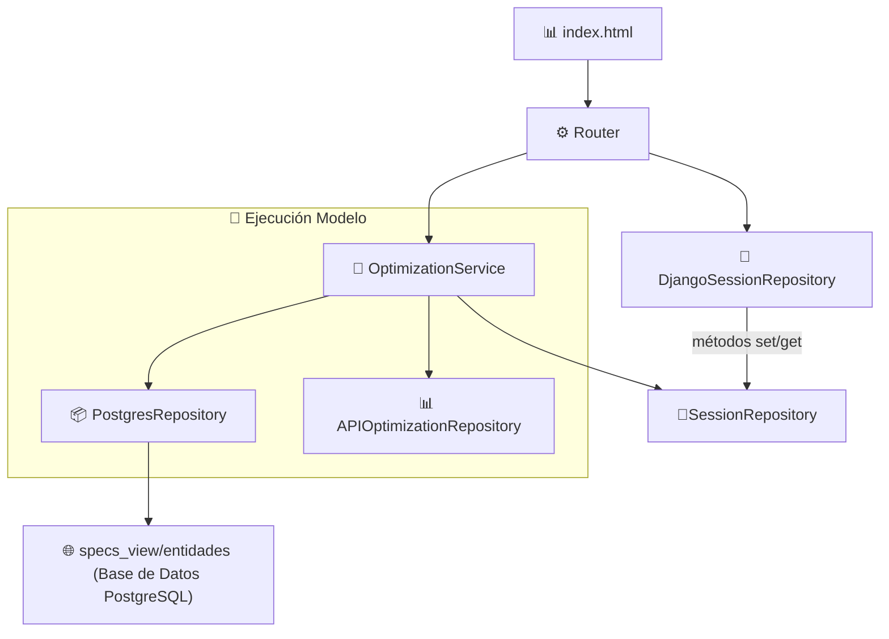

# Diagramas y Documentación del proyecto ODP

## Índice

1. [Entorno de Desarollo FrontEnd](https://github.com/gonzadiazfrp/odp_docs?tab=readme-ov-file#entorno-de-desarollo-frontend)
2. [Descripción técnica del flujo de datos](https://github.com/gonzadiazfrp/odp_docs?tab=readme-ov-file#descripci%C3%B3n-t%C3%A9cnica-del-flujo-de-datos)
3. [APIs del Modelo](https://github.com/gonzadiazfrp/odp_docs?tab=readme-ov-file#2-apis-de-datos)
4. [APIs de Datos](https://github.com/gonzadiazfrp/odp_docs?tab=readme-ov-file#3-visualizaci%C3%B3n-de-datos)
5. [Visualización de Datos](https://github.com/gonzadiazfrp/odp_docs?tab=readme-ov-file#3-visualizaci%C3%B3n-de-datos)
6. [Gestor de Políticas (Policy Modal)](#gestor-de-politicas-policy-modal)

---
# Entorno de Desarollo FrontEnd

### 1. Instalación de Dependencias

#### Python Dependencias
```bash
pip install -r requirements.txt
```
**Explicación**: Este comando instala todas las dependencias de Python listadas en el archivo `requirements.txt`. Este archivo contiene los nombres y versiones de los paquetes necesarios para que el proyecto funcione correctamente. Herramienta necesaria: **pip** (gestor de paquetes de Python).

#### Node.js Dependencias
```bash
npm install
```
**Explicación**: Este comando instala todas las dependencias de Node.js listadas en el archivo `package.json`. Estas dependencias son necesarias para el desarrollo del frontend del proyecto. Herramienta necesaria: **npm** (gestor de paquetes de Node.js).

### 2. Ejecutar Migraciones de Django

Antes de ejecutar las migraciones, necesitas tener el archivo `.env` en la raíz del proyecto y la base de datos PostgreSQL instalada y funcionando. Contacta al gestor del proyecto para obtener el archivo `.env`.

#### Crear Migraciones
```bash
python manage.py makemigrations
```
**Explicación**: Este comando crea archivos de migración basados en los cambios realizados en los modelos de Django. Estos archivos de migración son utilizados para aplicar cambios en la estructura de la base de datos.

#### Aplicar Migraciones
```bash
python manage.py migrate
```
**Explicación**: Este comando aplica las migraciones a la base de datos, creando o modificando las tablas según los modelos definidos en el proyecto. Herramienta necesaria: **Django** (framework web de Python).

### 3. Ejecutar el Servidor de Desarrollo de Django

```bash
python manage.py runserver
```
**Explicación**: Este comando inicia el servidor de desarrollo de Django, permitiéndote ver y probar el proyecto localmente. Por defecto, el servidor se ejecuta en el puerto 8000. Herramienta necesaria: **Django**.

### 4. Compilar Estilos con TailwindCSS y DaisyUI

```bash
npm run build:css
```
**Explicación**: Este comando utiliza `npx tailwindcss` para compilar los estilos de TailwindCSS y DaisyUI. El archivo `input.css` se convierte en `styles.css`, y el modo de vigilancia (`watch mode`) se activa para recompilar los estilos cada vez que se realicen cambios en el código. Herramientas necesarias: **TailwindCSS** y **DaisyUI**.

### Salida Esperada

```bash
(base) ➜  odp-web-api git:(dev) npm run build:css              

> build:css
> npx tailwindcss -i ./static/input.css -o ./static/styles.css --watch

Rebuilding...

🌼   daisyUI 4.12.14
├─ ✔︎ 1 theme added              https://daisyui.com/docs/themes
╰─ ★ Star daisyUI on GitHub     https://github.com/saadeghi/daisyui

Done in 452ms.
```
**Explicación**: Este mensaje indica que los estilos se han compilado correctamente y que el modo de vigilancia está activo. Deja este proceso corriendo mientras trabajas en el proyecto y abre otra ventana de terminal para ejecutar el servidor de desarrollo de Django.

### Herramientas Necesarias

1. **Python**: Lenguaje de programación utilizado para el backend.
2. **pip**: Gestor de paquetes de Python.
3. **Django**: Framework web de Python.
4. **PostgreSQL**: Base de datos relacional.
5. **Node.js**: Entorno de ejecución de JavaScript.
6. **npm**: Gestor de paquetes de Node.js.
7. **TailwindCSS**: Framework de CSS.
8. **DaisyUI**: Biblioteca de componentes UI basada en TailwindCSS.

### Resumen de Pasos

1. **Instalar dependencias**:
   - `pip install -r requirements.txt`
   - `npm install`
2. **Ejecutar migraciones de Django**:
   - `python manage.py makemigrations`
   - `python manage.py migrate`
3. **Ejecutar el servidor de desarrollo de Django**:
   - `python manage.py runserver`
4. **Compilar estilos con TailwindCSS y DaisyUI**:
   - `npm run build:css`

Siguiendo estos pasos, deberías tener el entorno de desarrollo configurado y el proyecto corriendo localmente.


---
# Descripción técnica del flujo de datos
Los datos visualizados en los componentes del dashboard (gráficas, tablas, reportes) no se obtienen directamente desde la base de datos relacional (PostgreSQL). En su lugar, estos datos son el resultado de un proceso de ejecución del modelo de optimización, el cual realiza transformaciones e inferencias a partir de ciertos datos de entrada.

El flujo de datos funciona de la siguiente manera:

- Origen de datos del modelo: el modelo se alimenta de datos estructurados que sí provienen desde la base de datos, en particular desde la vista specs_view/entidades.

- Procesamiento: el modelo se ejecuta mediante el componente OptimizationService, el cual orquesta la lógica de inferencia y procesamiento.

- Persistencia temporal: los resultados de dicha ejecución no se guardan en la base de datos. En cambio, son almacenados en estructuras de sesión (OptimizationSession, DjangoSessionRepository) para mantener su disponibilidad en la capa de presentación durante la sesión activa del usuario.

- Acceso y visualización: estos resultados procesados se acceden a través de Django, utilizando repositorios de sesión, y son finalmente renderizados en el front-end (index.html) como parte del dashboard.

- Este enfoque desacopla el almacenamiento permanente del ciclo de visualización, lo cual permite mantener el sistema más liviano, rápido y centrado en la experiencia del usuario final


---


| Nodo                          | Rol                                                                 |
|-------------------------------|----------------------------------------------------------------------|
| `index.html`                  | 📊 Interfaz frontend encargada de visualizar gráficos y reportes del dashboard. |
| `Router`                      | ⚙️ Punto de entrada REST que orquesta las llamadas API hacia los servicios backend. |
| `DjangoSessionRepository`     | 💾 Repositorio que persiste datos en la sesión actual del usuario utilizando mecanismos de Django. |
| `SessionRepository`           | 🔐 Interfaz o abstracción que define los métodos de acceso a datos de sesión (get/set). |
| `specs_view/entidades`        | 🌐 Vista de base de datos PostgreSQL que expone los datos base necesarios para ejecutar el modelo. |
| `OptimizationService`         | 🧠 Servicio que ejecuta la lógica principal del modelo de optimización e integra múltiples componentes. |
| `PostgresRepository`          | 📦 Repositorio encargado de consultar directamente la base de datos relacional para alimentar el modelo. |


# 1. APIs del Modelo
## 🧠 Clase `OptimizationService` 

- api/application/results/optimization/optimization_service.py

La clase `OptimizationService` es el núcleo del sistema de optimización. Se encarga de preparar, ejecutar y procesar los datos necesarios para optimizar recursos/productos en función de restricciones, costos y políticas. La clase OptimizationService es el centro del sistema.

Depende de dos componentes principales:

- OptmizationRepository, que ejecuta las consultas de negocio y el modelo.

- SessionRepository, que maneja los datos en sesión (caché, estado intermedio).

---

## 🏗️ Visión general

Esta clase:
- Toma datos de sesión y del repositorio.
- Arma estructuras de entrada para un modelo de optimización.
- Llama al modelo.
- Procesa y devuelve los resultados listos para ser usados.

---

## 🔒 Métodos privados

### `__get_parameters(request)`
Arma los parámetros generales del modelo:

- `cantidad_dias_habiles_mes`
- `capacidad_despostada_diaria`
- `dolar_blend`
- `mano_de_obra`
- `produccion_maxima_mensual`

Fuente: `SessionRepository`.

---

### `__update_entities_with_inputs(entities, datos_hacienda)`
Actualiza los datos de entrada (`entities`) con información real de hacienda:

- Peso, cantidad mínima/máxima, precio, porcentajes por calidad.
- Enlaza categorías y calidades según su `fk_categoria_hacienda`.

---

### `__get_change(item, changes)`
Devuelve un cambio registrado en caché si el índice coincide con el `item` actual.

---

## 🧩 Métodos públicos

### `apply_changes(request, entities, dolar_blend)`
🔧 Método principal de preparación.

**Pasos:**
1. Actualiza entidades con datos de hacienda.
2. Trae especificaciones de productos.
3. Crea el request para el maestro de producto/política.
4. Lo consulta (con caché y cambios aplicados).
5. Calcula las cuotas por producto y política.
6. Integra las políticas con las cuotas y categorías.
7. Devuelve:
   - Parámetros de entrada (`OptimizationParametersRequestModel`)
   - Entidades actualizadas
   - Integración de políticas
   - Cuotas por producto/política

---

### `run_model(request_data)`
Ejecuta el modelo optimizador de forma **asíncrona**:

- Devuelve `OptimizationResponseModel` o `OptmizationErrorModel`.

---

### `get_maestro_especificacion_producto_politica(request, request_data)`
Obtiene el **maestro de políticas por producto**:

- Lo busca primero en sesión (caché).
- Si no está, lo consulta.
- Aplica cambios personalizados y normaliza porcentajes.

---

### `get_ds_producto_politica_cuota(request, entities, maestro)`
Calcula las **cuotas por producto/política** con:

- Parámetros de entrada
- Entidades actualizadas
- Maestro

Resultado: `DSProductoPoliticaCuotaResponseModel`

---

### `get_ds_integracion_politica(request, cuotas, categorias, politicas, entradas_res)`
Integra todo en políticas finales:

- Usa un request armado con cuotas, categorías, políticas y entradas.
- Aplica porcentajes desde caché si existen.

Resultado: `List[IntegracionPoliticaModel]`

---

### `get_detalle_integracion_politica(request, cuotas, integracion, dolar_blend, fk_politica)`
Devuelve el detalle de una política específica.

- Si ya está cacheado, lo devuelve.
- Si no, lo solicita al repositorio.
- Se guarda para futuras consultas.

Resultado: `DetalleIntegracionPoliticaModel`

---

## 📦 Modelos involucrados

- `OptimizationRequestModel`
- `OptimizationResponseModel`
- `OptimizationEntitiesRequestModel`
- `OptimizationParametersRequestModel`
- `MaestroEspecificacionProductoPoliticaRequest`
- `MaestroEspecificacionProductoPoliticaItem`
- `DSProductoPoliticaCuotaRequestModel`
- `DSProductoPoliticaCuotaResponseModel`
- `DSProductoPoliticaCuotaModel`
- `DSIntegracionPoliticaRequestModel`
- `IntegracionPoliticaModel`
- `DetalleIntegracionPoliticaRequestModel`
- `DetalleIntegracionPoliticaResponseModel`
- `DetalleIntegracionPoliticaModel`

---

## 🧠 Resumen general

| Método                           | Función clave                                                  |
|----------------------------------|----------------------------------------------------------------|
| `__get_parameters`               | Arma parámetros globales del modelo                            |
| `__update_entities_with_inputs`  | Completa entidades con datos reales de hacienda                |
| `apply_changes`                  | Prepara toda la estructura previa a la optimización            |
| `run_model`                      | Ejecuta el modelo optimizador                                  |
| `get_maestro_especificacion_producto_politica` | Consulta/actualiza el maestro producto-política         |
| `get_ds_producto_politica_cuota` | Calcula cuotas por política y producto                         |
| `get_ds_integracion_politica`    | Integra datos con políticas definidas                          |
| `get_detalle_integracion_politica` | Muestra detalle por política específica                       |

---

💬 *Este servicio orquesta todo el flujo de la lógica de optimización, asegurándose de que los datos estén actualizados, consistentes y correctamente integrados antes y después de ejecutar el modelo.*


---
# 2. APIs de Datos
##  🗃️ app 'FastAPI' 

- api/main_api.py

## 🧠 Descripción General

Esta API permite generar los datasets necesarios y ejecutar un modelo de optimización de políticas para producción ganadera. A través de distintos endpoints se procesan datos, se realizan validaciones, integraciones y transformaciones hasta obtener los resultados del modelo optimizado.

---
## 📌 Endpoints Clave

### 🔹 get_maestro_especificacion_producto_politica

- **Método:** `POST`
- **Input:** 
  - `especificacion_producto`
  - `dolar_blend`
  - `entities`
- **Output:** 
  - `maestro_especificacion_producto_politica`
- **Uso:** Paso previo para generar la relación producto-política-cuota.

---

### 🔹 get_ds_producto_politica_cuota

- **Método:** `POST`
- **Input:**
  - `maestro_especificacion_producto_politica`
  - `entities`
  - `input_values:` Valores de entrada básicos para el modelo de optimización. Incluye parámetros operativos y financieros necesarios para los cálculos
- **Output:**
  - `ds_producto_politica_cuota`
  - `entidad_politica`
  - `input_values`
- **Uso:** Relaciona productos con políticas y calcula capacidades productivas. Crea el maestro de producto política calculando todas las métricas asociadas como el total de costos, el total de impuestos, precio neto, integración por producto, etc.

---

### 🔹 get_ds_integracion_politica

- **Método:** `POST`
- **Input:**
  - `ds_producto_politica_cuota:` Dataset que establece qué productos están asociados a qué políticas y cuotas específicas.
  - `entidad_categoria_hacienda:` Lista de categorías de hacienda con sus atributos. Contiene información sobre las diferentes categorías de ganado disponibles.
  - `entidad_politica:` Lista de políticas de producción con sus características. Define las diferentes políticas de producción disponibles.
  - `entidad_entrada_res:` Lista de entradas de res con sus características. Define las diferentes entradas de res disponibles.
- **Output:** 
  - `ds_integracion_politica`
- **Uso:** Integra políticas considerando entradas, cuotas y restricciones.

# 3. Visualización de Datos

## 🧠 Trazabilidad y Edición de Gráficos de la App

Este documento describe el flujo de datos y la trazabilidad para los gráficos en el dashboard, así como las instrucciones para su modificación futura.

---

## 🔁 Flujo de datos

1. **Lógica de negocio**
   - 📄 Archivo: `api/domain/pages/dashboard/production_tons/production_tons_model.py`
   - Contiene el modelo `ProductionTonsModel` que define los campos de toneladas:
     - `total_toneladas_con_hueso`
     - `total_toneladas_sin_hueso`
     - `total_toneladas_hueso`
     - ...
   - Es el punto donde se estructuran los datos a visualizar.

2. **Servicio de implementación**
   - ⚙️ Archivo: `api/application/pages/dashboard/dashboard_page_service.py`
   - Método: `get_production_tons(request: Request) -> ProductionTonsModel | None`
   - Recupera los resultados optimizados (`model_result`) y los transforma en una instancia del modelo.
   - Esta función alimenta la vista con los datos finales que serán graficados.

3. **Renderizado HTML (Frontend)**
   - 📁 Archivo: `templates/pages/dashboard/index.html`
   - Fragmento relevante:
     ```html
     <div 
       hx-get="/api/dashboard/get_production_tons_graph/"
       hx-trigger="intersect once, modelExecuted from:body, sessionLoaded from:body"
       hx-swap="innerHTML"
       class="h-[566px] bg-white overflow-hidden rounded-md"
     >
       <div>Cargando...</div>
       <span class="loading loading-spinner text-primary"></span>
     </div>
     ```
   - Usa **HTMX** para hacer una solicitud al endpoint `/api/dashboard/get_production_tons_graph/`.
   - Este endpoint devuelve un fragmento HTML con una imagen renderizada del gráfico.

4. **Parcial HTML del gráfico**
   - 📄 Fragmento (ej. `partials/_production_tons_graph.html`)
   - Renderiza la imagen del gráfico como:
     ```html
     
     ```

---

## 🎯 Cómo modificar el gráfico

### 1. Estilo visual desde el **HTML**
- Se puede modificar la presentación del gráfico (bordes, tamaño, espaciado, etc.) en `index.html` o el parcial.
- Ejemplo:
  ```html
  

### 2. Contenido del gráfico (colores, tipos, leyendas, ejes, etc.)

❗ **Se modifica desde el backend**, en el método que genera el gráfico  
(probablemente en `dashboard_page_service.py` o en algún módulo relacionado con gráficos).

Buscá una función que utilice **matplotlib**, **plotly** u otra librería para renderizar el gráfico y convertirlo en una imagen `base64`.

### Podés cambiar:
- Colores de barras
- Tipo de gráfico
- Títulos, leyendas, etiquetas
- Estilo de fuentes, tamaños, alineación

---

### 🧪 Verificación y Debugging

Para verificar que el gráfico se actualiza correctamente:

1. Ejecutar una sesión desde el dashboard.
2. Observar que se active el request:  
   `hx-get="/api/dashboard/get_production_tons_graph/"`
3. Confirmar que la imagen se actualiza con los nuevos datos.

Si la imagen **no** cambia:

- Verificar que el objeto `model_result` se esté actualizando correctamente.
- Asegurarse de que el gráfico se genere nuevamente en cada solicitud.

---
# 5. Gestor de Políticas (Policy Modal)

Este documento describe el funcionamiento completo del **Gestor de Políticas** en la aplicación, incluyendo el flujo de datos, la interacción entre el frontend y el backend, y los archivos involucrados.

---

### 📁 Archivos Involucrados

| Archivo                        | Rol Principal |
|-------------------------------|---------------|
| `router.py`                   | Lógica de backend, carga y actualización de datos |
| `_policy_modal.html`          | Contenedor del modal HTML |
| `_policy_modal_content.html`  | Contenido del modal con formularios y datos |
| `policy_modal.js`             | Lógica dinámica (eventos, validaciones, AJAX) |

---

### 🔄 Flujo de Funcionamiento

### 1. Apertura del Modal

- Desde el frontend, un botón (o acción) hace una solicitud a Django para abrir el modal de políticas.
- El contenido se carga dinámicamente usando **HTMX** y se inyecta en el `div` con ID `policy_modal_content`.


```html
<dialog id="policy_modal">
  <div id="policy_modal_content">
    <!-- Aquí se inyecta _policy_modal_content.html -->
  </div>
</dialog>
```

---

### 🔁 2. Backend: `router.py`

### 🔧 Función: `_prepare_policy_modal_data(request, pk)`
- Si `pk` es `None`, crea una política vacía.
- Si `pk` está definido, obtiene la política existente y sus relaciones:
  - Calidad de Hacienda
  - Cuarto
  - Entrada
  - Productos relacionados

También obtiene:
- Todos los cuartos (`all_cuartos`)
- Todas las entradas (`all_entradas`)
- Todas las calidades (`all_calidades`)
- Todos los destinos, productos y especificaciones

---

### 🌐 Función: `_render_policy_modal(data)`
- Usa el contexto preparado para renderizar el HTML parcial: `_policy_modal_content.html`

---

### ✅ Guardado: `_full_policy_update(payload, pk)`
- Valida datos de política y productos.
- Verifica que el rendimiento total coincida con el rendimiento de entrada.
- Actualiza o crea registros en la base de datos.

---

### 💻 3. Contenedor Modal: `_policy_modal.html`

- Contiene el `<dialog>` con `id="policy_modal"`.
- Escucha eventos `htmx:afterSwap` para abrir el modal cuando el contenido es cargado.
- Usa JS embebido para cerrar el modal, y lanzar el trigger personalizado `modalClosed`.

---

### 🧱 4. Contenido del Modal: `_policy_modal_content.html`

- Usa variables inyectadas desde Django (`{{ policy.nombre_politica }}`, etc.).
- Contiene:
  - Formulario de política
  - Selects dinámicos
  - Tabla con productos relacionados
  - Botones para guardar, filtrar, agregar productos, borrar selección

Incluye JS inline para:
- Validación de campos
- Activación del botón “Guardar” cuando hay cambios
- Cálculo de rendimiento total

---

### ⚙️ 5. Frontend JS: `policy_modal.js`

Controla toda la lógica interactiva del modal:

### ✅ Cargar Modal
```js
document.body.addEventListener('htmx:afterSwap', function (event) {
  if (event.detail.target.id === 'policy_modal_content') {
    initializeTable(); // carga la tabla
  }
});
```

---

### ✅ Guardar Cambios
```js
fetch(`/api/politicas/${policyId}/update_policy/`, {
  method: 'PUT',
  body: JSON.stringify({ policy, products })
});
```

- Recoge datos del formulario.
- Valida que existan productos válidos.
- Muestra errores con `showToast()` o `alert()`.
- Cierra el modal y refresca vista si todo sale bien.

---

### ❌ Eliminar Productos
```js
fetch(`/api/politicas/${policyId}/delete_products/`, {
  method: 'DELETE',
  body: formData
});
```

---

### 📊 Calcular Rendimiento Total
```js
function recalculateTotalRendimiento() {
  // Suma los valores de los inputs .rendimiento-field
}
```

---

### ➕ Agregar Fila de Producto
- Inserta una nueva fila con selects vacíos y campos listos para completar.

---

#### 🧩 Datos Importantes

- Todos los `select`, `input`, y `checkboxes` están marcados con clases `.policy-field` o `.product-field`.
- El botón "Guardar" se activa solo cuando hay cambios detectados.
- HTMX facilita las actualizaciones parciales sin recargar toda la página.

---

### ✅ Validaciones Clave

### Backend
- Valida:
  - Campos obligatorios (nombre, cuarto, entrada, etc.)
  - Que el rendimiento total de productos coincida con el de entrada

### Frontend
- Bloquea acción si:
  - Faltan campos requeridos
  - No hay productos agregados
  - Hay errores de red o formato
